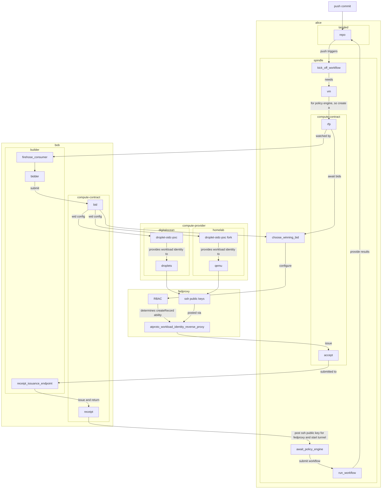

# Compute Contract Reference Implementation PoC

> This is just a Proof of Concept to prove out the idea. Will be re-written once
> it all is organized in a way that makes sense and lexicon makes sense

Draft RFC: https://requested.fyi/d/did:plc:5svqtrhheairglgiiyvutzik/3mn3lewitmq2u

