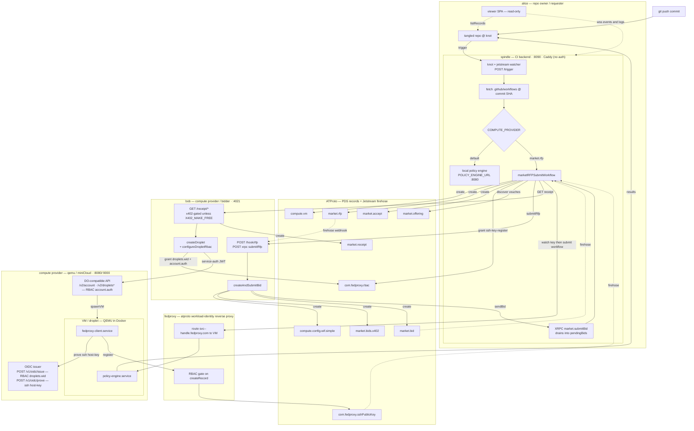
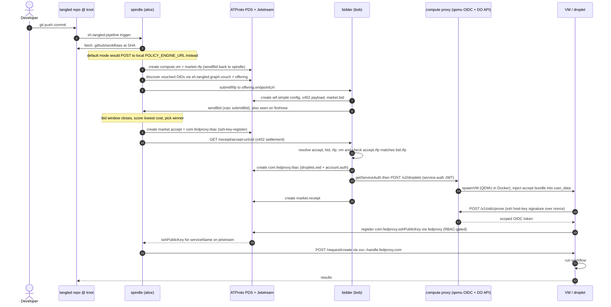

# Compute Contract Reference Implementation PoC

> This is just a Proof of Concept to prove out the idea. Will be re-written once
> it all is organized in a way that makes sense and lexicon makes sense

Draft RFC: https://requested.fyi/d/did:plc:5svqtrhheairglgiiyvutzik/3mn3lewitmq2u

A decentralized compute marketplace on AT Protocol. A repo's CI pipeline is
auctioned to compute providers; the winning **bidder** provisions a VM that runs
the workflow. Identity, the auction, and the audit trail are all ATProto records;
authorization roots in DID resolution + JWT verification. Security analysis lives
in [THREATS.md](./THREATS.md); the record schemas live in
[`lexicons/`](./lexicons/README.md).

The two diagrams below are generated from the code under `src/typescript/`
(`spindle/`, `bidder/`, `qemu/`, `spindle-viewer-spa/`).

## Components

| Component | Code | Port | Role |
|-----------|------|------|------|
| **spindle** (alice) | `spindle/main.ts`, `marketRFP.ts` | `:8090` | CI backend. Watches knots/jetstream for `sh.tangled.pipeline` triggers, fetches `.github/workflows/*` at the commit SHA, and runs them on a **local policy engine** (default) **or** auctions them via the market (`COMPUTE_PROVIDER=market.rfp`). Fronted by Caddy (no auth). |
| **bidder** (bob) | `bidder/main.ts` | `:4021` | Market seller. Reacts to RFPs (`/hook/rfp`, `submitRfp`), creates bids, and on x402 settlement (`/receipt/*`) provisions a droplet through the RBAC-gated compute proxy. |
| **qemu / miniCloud** | `qemu/main.ts` + helpers | `:8080`/`:9000` | DigitalOcean-compatible API + OIDC issuer. RBAC-gates `/v1/oidc/issue`, `/v2/account`, `/v2/droplets*`; spawns QEMU VMs in Docker. |
| **fedproxy** | external ([atproto-reverse-proxy](https://github.com/publicdomainrelay/atproto-reverse-proxy)) | — | ATProto workload-identity reverse proxy. RBAC-gates `createRecord` (lets a booted VM register its SSH key) and routes `<svc>--<handle>.fedproxy.com` to the VM's policy engine. |
| **viewer** | `spindle-viewer-spa/` | static | Read-only SPA. Resolves a repo's `knot`/`spindle` via `listRecords`, then streams `wss://<spindle>/events` and `/logs`. |

Record types (all `com.publicdomainrelay.temp.*` pre-stable): `compute.vm`,
`compute.config.wif.simple`, `market.rfp`, `market.offering`, `market.bid`,
`market.bids.x402`, `market.accept`, `market.receipt` (+ XRPC `market.submitRfp`,
`market.submitBid`). Cross-org: `com.fedproxy.rbac`, `com.fedproxy.sshPublicKey`,
`sh.tangled.pipeline`, `sh.tangled.graph.vouch`.

## Architecture & data flow

## End-to-end auction (`COMPUTE_PROVIDER=market.rfp`)

