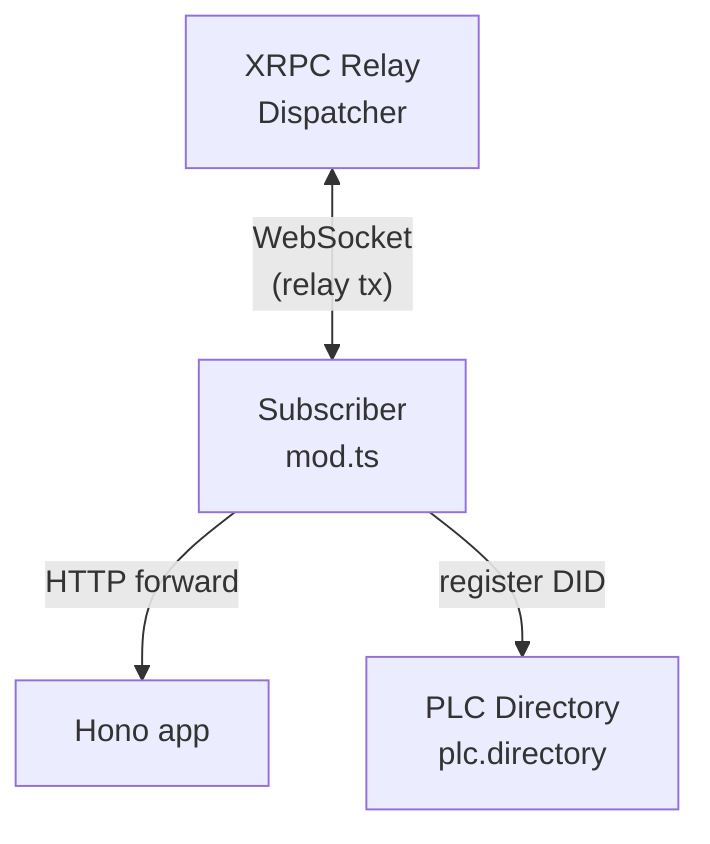

# xrpc-relay-example

Minimal Hono server reachable through XRPC relay tunnel. Self-registers ephemeral PDS via PLC directory — no atproto account needed.

## What it does

- Starts Hono HTTP server
- Registers DID (did:plc) on PLC directory with signing key as rotation key
- Connects to XRPC relay dispatcher via WebSocket
- Relay forwards incoming requests to local Hono app — app responds as if publicly hosted
- Public URL: `https://<subdomain>.<DISPATCHER_HOST>/`

Two modes:

| Mode | Flag | Auth |
|------|------|------|
| Ephemeral PDS (default) | — | Self-signs service auth with keypair |
| External PDS | `--use-existing-atproto` | Logs into existing PDS, calls `getServiceAuth` |

## Quick start

```bash
# Ephemeral PDS — self-register, zero config
deno run -A mod.ts

# Fresh keypair every run (not persisted)
deno run -A mod.ts --fresh-keypair

# Fresh keypair persisted to custom path
deno run -A mod.ts --fresh-keypair --keypair-path ./my-keypair.json

# External PDS — use existing Bluesky account
deno run -A mod.ts --use-existing-atproto --handle you.bsky.social --password xxx

# Write proxy ref URL to file (for CI / other processes)
deno run -A mod.ts --write-proxy-ref-http-to-path registry-https-url.txt
```

All flags fall back to `UPPER_SNAKE_CASE` env vars. Run `deno run -A mod.ts --help` for full list.

## Endpoints

```
GET  /                              → { ok: true, server, did }
POST /xrpc/com.ari3lla.protfolio.contactForm → { echo: body, callerDid }
GET  /hello/:name                   → { greeting: "Hello, {name}!" }
*    *                              → 404
```

## Architecture



Flow:
1. Load or create Secp256k1Keypair
2. Build genesis PLC operation (`createGenesisOp`)
3. Check DID doesn't already exist → `plc.submitOp(did, op)`
4. Create `Signer` wrapping keypair
5. `createSubscriber` connects WebSocket to relay dispatcher
6. Incoming relayed requests → `handleRequest` → `app.fetch(request)` → response

## How to write code like this

Full reference implementation: [`mod.ts`](./mod.ts).

### Recipe

**1. CLI** — parse flags with `@cliffy/command`. Each option falls back to env var. Omit `default` on `--keypair-path` so you can detect explicit vs implicit for persist logic.

**2. Keypair** — `Secp256k1Keypair` from `@atproto/crypto`. `create()` to generate, `import(hex)` to restore. Store `privateKeyHex` to JSON file. For `--fresh-keypair`: skip load, only persist when `--keypair-path` explicitly passed.

**3. DID registration** — `PlcClient` + `createGenesisOp` from `@publicdomainrelay/did-plc`. Build genesis op with rotation keys, verification methods, service endpoint, `alsoKnownAs`. Sign with keypair. Check `plc.resolve(did)` first — same keypair always produces same DID, so catch `PlcNotFoundError` to detect idempotent re-registration.

**4. Service auth** — `signServiceAuth` from `@publicdomainrelay/hono-factory-atproto-repo`. Build a `Signer` (`{ did, sign }`) from your keypair + DID, then `signServiceAuth(signer, { aud: dispatcherDid, lxm })`. For external PDS mode, use `Agent.com.atproto.server.getServiceAuth()` instead.

**5. Hono app** — standard `@hono/hono`. Add `cors()`, define routes. No special XRPC handling needed — relay forwards raw HTTP.

**6. Relay subscriber** — `createSubscriber` from `@publicdomainrelay/xrpc-relay`. Pass `keypair`, `getServiceAuthToken`, `dispatcherHost`, and `handleRequest`. `handleRequest` receives relayed requests, builds standard `Request`, calls `app.fetch(request)`, returns `{ status, body, contentType }`.

### Key types

| Import | From | Purpose |
|--------|------|---------|
| `Secp256k1Keypair` | `@atproto/crypto` | Signing keypair for DID auth |
| `PlcClient`, `createGenesisOp`, `PlcNotFoundError` | `@publicdomainrelay/did-plc` | PLC directory client, genesis op builder |
| `Signer`, `signServiceAuth` | `@publicdomainrelay/hono-factory-atproto-repo` | Service auth JWT signing |
| `createSubscriber`, `log`, `hostnameOnly` | `@publicdomainrelay/xrpc-relay` | Relay WebSocket subscriber |
| `Agent`, `CredentialSession` | `@atproto/api` | External PDS login (optional) |
| `Hono`, `cors` | `@hono/hono` | HTTP framework |
| `Command` | `@cliffy/command` | CLI argument parsing |
